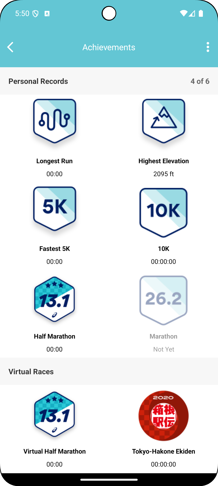

# Medal Case App

Welcome to the Medal Case app! This application showcases all your medals in a grid view. The app is built following the MVVM (Model-View-ViewModel) architecture, and it utilizes data binding and view binding for a seamless and efficient development process.

## Features

- **Grid View Display**: All medals are displayed in a grid format with headers for better organization and visual appeal.
- **MVVM Architecture**: The app is designed following the MVVM architecture, promoting a clean separation of concerns and facilitating easier testing and maintenance.
- **Data Binding**: Utilizes Android's data binding library to bind UI components in layouts to data sources in a declarative manner.
- **View Binding**: Uses view binding to more easily write code that interacts with views, providing compile-time safety for referencing views.

## Screenshots



## Installation

To clone and run this application, you'll need Git and Android Studio installed on your computer. From your command line:

```bash
# Clone this repository
$ git clone https://github.com/rajdeepf1/MedalCase.git

# Go into the repository
$ cd MedalCase

# Open in Android Studio and run the app
